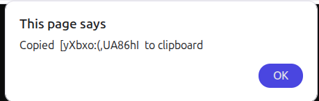

# Getting Started
Install the dependencies and run the project
```
npm install
npm start
```

Head over to https://vitejs.dev/ to learn more about configuring vite

# Personal notes
Used for loops, arrays, onclick function calls, and using the random() and floor() from Math library to generate a randomized 15 character password for the user. 

## New things I learned here: 
- `navigator.clipboard.writeText()` - so that a user can copy the text on one of the buttons, 
  - used in index.js, --> navigator.clipboard.writeText(pwdElOne.textContent)
- `alert()` - It's the one with a pop up on the page,
  - 
  -  Code: `alert("Copied " + " " + pwdElOne.textContent + " "+ " to clipboard")`
